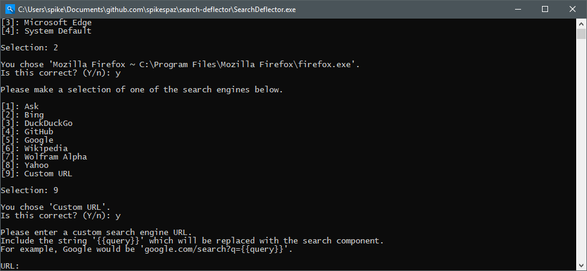
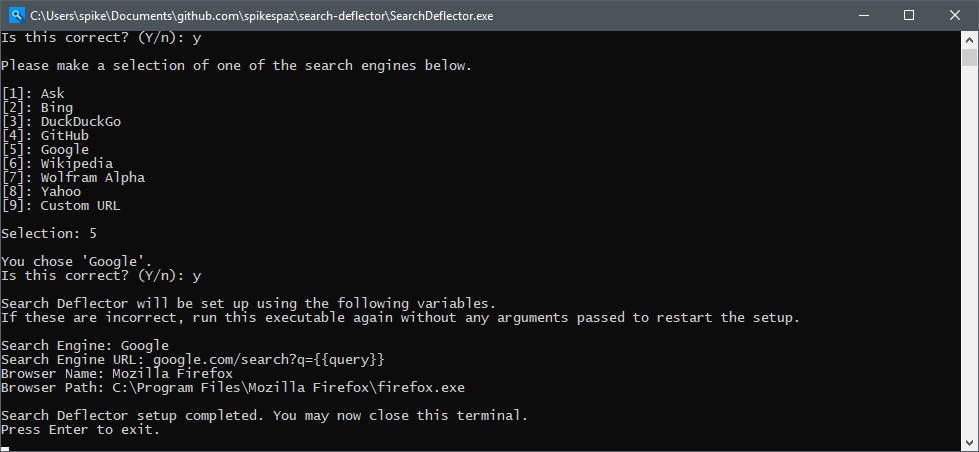

# Search Deflector

This is a small program that will redirect searches made with Cortana and the Start Menu to your preferred browser and search engine. While this software is extremely similar to Edge Deflector and Search With My Browser, it allows the user to use any search engine they want and select any installed browser--not just the system default.

## Donations

If you would like to show appreciation for my work, I would gladly accept a small donation!

I will accept donations through PayPal.Me, Buy Me a Coffee, or Patreon.

## Setup

You must manually download and set up this new update, but after that, everything should be automatic.

* **Please remember to delete the old directory that contains files from previous versions if you are manually updating.**

1. Go to the [releases page](https://github.com/spikespaz/search-deflector/releases) and download the installer executable.

2. Run the installer executable.
   * I didn't sign the executable, so you will get a warning saying "Windows protected your PC".
   * If you trust me, click the small text that says "More info", then the button "Run anyway".

3. Follow the prompts that the installer gives you. Agree to the license, and read the information on the second page.

4. Once you get to the part where a command prompt window pops up, follow the detailed instructions below.

If you need the old instructions to install version before I added the automatic updater, look at the [`README.md` file in an old commit](https://github.com/spikespaz/search-deflector/blob/3a5dd058c675f59e9aede303d6b333a29d94306a/README.md).

### 1. Choosing a browser

In the below screenshot, I have selected option 2 for Firefox. Search Deflector will scan your registry for programs that are capable of handling URL protocols, and list them for you to choose. Just enter the number in square brackets next to the browser you want. Press Enter, and then Y or N to confirm or pick again.

### 2. Choosing a search engine

Same as the browser, select the search engine you would like to use. If the search engine you want is missing, please create a [new issue](https://github.com/spikespaz/search-deflector/issues/new) and request that it be added, or fork the repository and add it to [`engines.txt`](https://github.com/spikespaz/search-deflector/blob/master/engines.txt), then submit a pull request.

See [the next section](#3-using-a-custom-url) for details on the last option, "Custom URL".

### 3. Using a custom URL

**If you chose the last option, "Custom URL", in the previous step, keep reading. Otherwise, skip to the next section.**

Here, you can enter a custom URL to use as a search engine. It must include the string `{{query}}`, which will be replaced with your search URI component. Please do not enter the `https?://` protocol part of the URL, it will be ignored. See [`engines.txt`](https://github.com/spikespaz/search-deflector/blob/master/engines.txt) for examples on the format.

The program will then check the validity of your input by sending a GET request to the URL. If it succeeds and returns 200, you can move forward.

If you use this option, please create a [new issue](https://github.com/spikespaz/search-deflector/issues/new) and request that it be added, or fork the repository and add your search engine to [`engines.txt`](https://github.com/spikespaz/search-deflector/blob/master/engines.txt), then submit a pull request.

### 4. Finishing the setup

The setup is complete. Make sure that the information listed is what you expected it to be. If it isn't, select all of the console output and paste it into a [new issue](https://github.com/spikespaz/search-deflector/issues/new) on GitHub. That is unintentional. If there was a crash before you get to this point, do the same.

**As of version [0.1.0](https://github.com/spikespaz/releases/tag/0.1.0), if an error occurs you will recieve a message box that has a "Help" button. If you click it, it will redirect you to the GitHub issues page with all of the crash information filled out for you. You just need to set a title.**

When reporting errors, include as much detail as you can. Tell me what happened before the crash, if you have any idea why the crash might have happened.

# Building

You need a D compiler. I recommend [`LDC2`](https://github.com/ldc-developers/ldc/releases), if you have that you can just run `build.sh` with MinGW or Git Bash. Read the build script to figure out what needs to be done.

You need `rcedit.exe` on your system `PATH` variable to add the icon to the executable. Get that from https://github.com/electron/rcedit.
